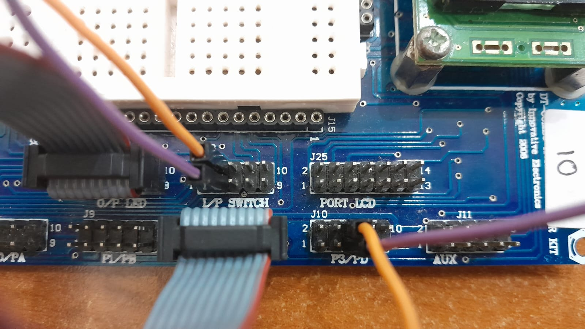
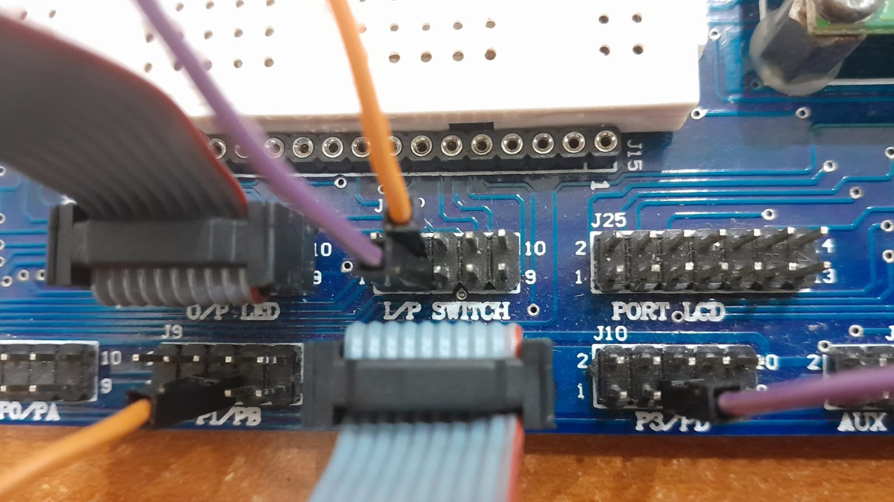
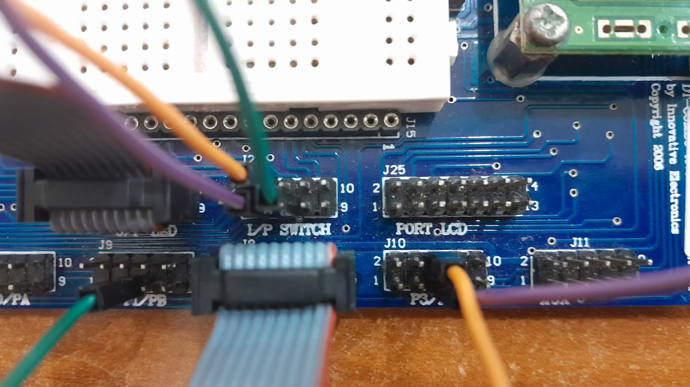

# BAB 2 - Interrupt

`#include <avr/interrupt.h>`

## Langkah-Langkah Menggunakan *Interrupt*

A. Panggil function `sei()`. 
> ini memberikan nilai `1` untuk I-bit pada SREG
 I-bit bernilai `1` => *interrupt* global di-enable-kan

B. Atur nilai `GICR` untuk mengaktifkan interupsi eksternal tertentu:
> INT0 / INT1 / INT2
> * INT0 di bit 6
> * INT1 di bit 7
> * INT2 di bit 5

> (berikan nilai `1` untuk mengaktifkan)

C. Atur nilai `MCUCR` dan `MCUCSR` untuk menetapkan jenis pemicuan masing-masing *interrupt*.
> INT0 dan INT1 pada `MCUCR`
> * INT0 => ISC01 & ISC00 (bit 1 & bit 0)
> * INT1 => ISC11 & ISC10 (bit 3 & bit 2)

> INT2 pada `MCUCSR`
> * INT2 => ISC2 (bit 6)

D. Definisikan function `ISR()` dengan parameter untuk *interrupt* yang sedang digunakan.
> Parameter dapat menggunakan alias berikut:
> * `INT0_vect` untuk INT0
> * `INT1_vect` untuk INT1
> * `INT2_vect` untuk INT2

## Pemasangan Pin *Interrupt* ke Pushbutton

### INT0 dan INT1

>   INT0: PD2 -> I/P SWITCH bit 0
 INT1: PD3 -> I/P SWITCH bit 1

### INT0 dan INT2

>   INT0: PD2 -> I/P SWITCH bit 0
 INT2: PB2 -> I/P SWITCH bit 1

### INT0, INT1, dan INT2

>   INT0: PD2 -> I/P SWITCH bit 0
 INT1: PD3 -> I/P SWITCH bit 1
 INT2: PB2 -> I/P SWITCH bit 2
