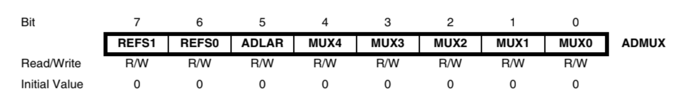
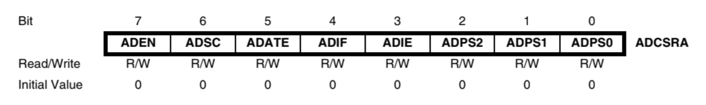
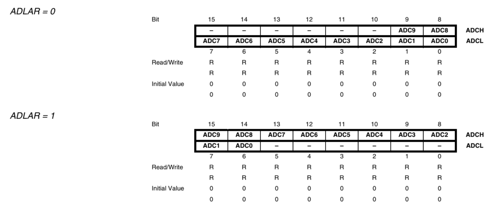

# BAB 4 - USART & ADC

## Analog-to-Digital Converter
ADC yang tersedia pada Atmega8535 memiliki spesifikasi dan fitur sebagai berikut.
* Resolusi 10 bit
* Akurasi $\pm\ 2$ LSB
* Waktu konversi $65 - 260\ \mu s$
* 8 saluran multiplexed
* Rentang tegangan input $0 - V_{CC}$
* Tegangan referensi $2.56 V$ tersedia untuk dipilih
* Memulai konversi dengan interupsi $\rightarrow$ ADC Auto Trigger
* Interupsi (`ADC_vect`) saat konversi selesai

### Register yang Berhubungan
#### A. ADMUX - ADC Multiplexer Selection Register

* `REFS1:0` (Reference Selection)
 Digunakan untuk menentukan sumber tegangan referensi ($V_{ref}$).
* `ADLAR` (ADC Left Adjust Result)
 Digunakan untuk mengatur penggunaan 10 dari 16 (2 $\times$ 8) bit pada ADCH + ADCL. Ilustrasi penempatan nilai hasil konversi berdasarkan `ADLAR` dapat diamati pada gambar [register data ADC](#adc-register).
* `MUX4:0`
 Digunakan untuk memilih saluran input analog dan gain pada penggunaan tegangan input diferensial.

#### B. ADCSRA - ADC Control and Status Register A

* `ADEN` (ADC Enable)
 Digunakan mengktifkan ADC.
* `ADSC` (ADC Start Conversion)
 Masukkan nilai `1` pada bit ini untuk memulai suatu konversi. Bit ini akan tetap bernilai `1` selama konversi sedang berlangsung. 
* `ADATE` (ADC Auto Trigger Enable)
 Digunakan untuk mengaktifkan Auto Triggering pada ADC.
* `ADIF` dan `ADIE`
 `ADIE` (ADC Interrupt Enable) digunakan untuk mengaktifkan ADC Conversion Complete Interrupt. `ADIF` menyimpan flag `1` setiap kali konversi selesai dilakukan. `ADIF` akan di-clear (`0`) setelah `ISR(ADC_vect)` dieksekusi.
> Catatan: Jangan lupa mengaktifkan I-bit pada SREG atau memanggil `sei()` jika hendak menggunakan interupsi ini
* `ADPS2:0` (ADC Prescaler Select)
 Digunakan menentukan division factor antara frekuensi XTAL dan clock input pada ADC.

#### C. ADC Data Register

Register `ADCH` dan `ADCL` bersama menyimpan nilai hasil konversi. Karena resolusi dari ADC Atmega8535 adalah 10 bit maka hasil konversi akan memiliki rentang 0 - 1023 ( $2^{10}$ level). 
Pengaksesan nilai hasil konversi dapat menggunakan keyword `ADC` secara langsung (tidak harus mengakses `ADCH` dan `ADCL` secara terpisah).

## USART